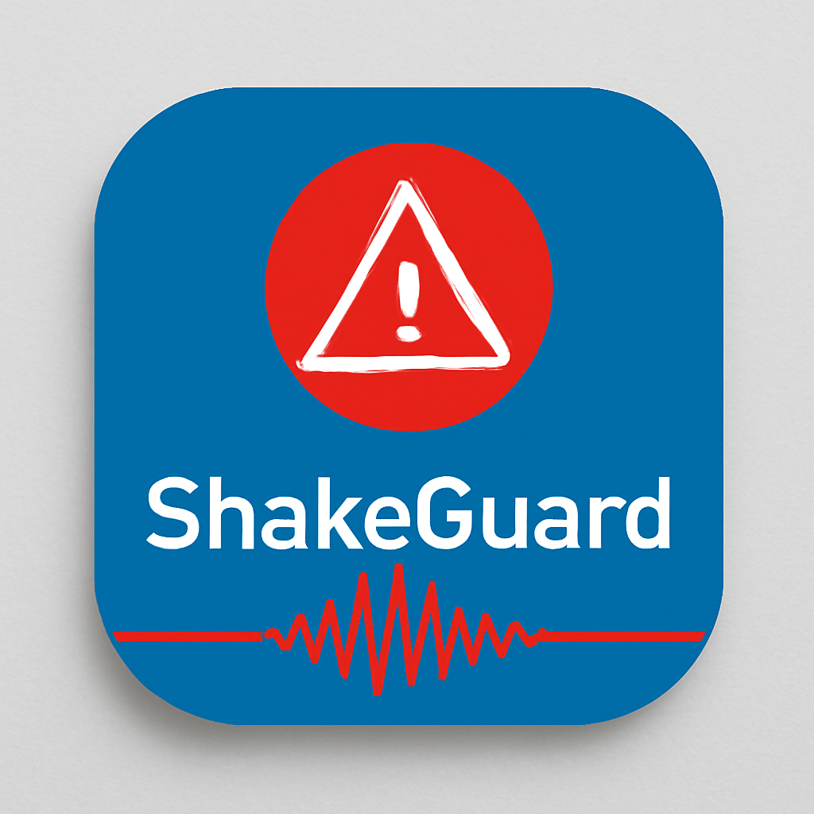

# 🛡️ ShakeGuard

**Your Personal Earthquake Early Warning System**

ShakeGuard is an advanced earthquake detection and early warning mobile application built with React Native and Expo. It uses device sensors to monitor seismic activity and provides real-time alerts to help keep you and your community safe.



## ✨ Features

### 🔍 Real-time Detection
- Continuous accelerometer and gyroscope monitoring
- Advanced earthquake detection algorithms
- Automatic intensity calculation and classification

### ⚡ Early Warning System
- Calculates seismic wave arrival times
- Push notifications to nearby users
- Urgent alerts for waves arriving in <10 seconds
- Community-based earthquake reporting

### 🛡️ Emergency Defense Mode
- Auto-activates for high-intensity earthquakes (>2.5)
- Reduces screen brightness to conserve battery
- Sends emergency location to database
- False alarm protection with 30-minute cooldown

### 👨‍👩‍👧‍👦 Family Safety Network
- Create and join family groups with unique codes
- Share real-time safety status (Safe/Warning/Emergency)
- Location sharing during emergencies
- Emergency contact management

### 📦 Emergency Kit Checklist
- Comprehensive emergency preparedness checklist
- Categories: Water, Food, Medical, Tools, Communication, Shelter, Documents
- Progress tracking with completion percentages
- Custom item addition and notes

### 🗺️ Live Earthquake Map
- Real-time earthquake reports from community
- Interactive map with intensity visualization
- Report filtering by time range and intensity
- Submit earthquake reports with location

### 📊 Community Heatmap
- Visualize earthquake activity patterns
- Risk assessment by region
- Activity clustering and analysis
- Historical data trends

### 📱 Modern UI/UX
- Dark/Light theme support with system preference
- Smooth animations and micro-interactions
- Responsive design for all screen sizes
- Intuitive navigation with tab-based layout

## 🚀 Getting Started

### Prerequisites
- Node.js (v16 or higher)
- npm or yarn
- Expo CLI
- iOS Simulator or Android Emulator (for testing)

### Installation

1. **Clone the repository**
   ```bash
   git clone https://github.com/yourusername/shakeguard.git
   cd shakeguard
   ```

2. **Install dependencies**
   ```bash
   npm install
   ```

3. **Set up environment variables**
   Create a `.env` file in the root directory:
   ```env
   EXPO_PUBLIC_SUPABASE_URL=your_supabase_url
   EXPO_PUBLIC_SUPABASE_ANON_KEY=your_supabase_anon_key
   ```

4. **Start the development server**
   ```bash
   npm run dev
   ```

5. **Run on device/simulator**
   - Scan QR code with Expo Go app (iOS/Android)
   - Press `i` for iOS simulator
   - Press `a` for Android emulator

## 🏗️ Tech Stack

### Frontend
- **React Native** - Cross-platform mobile development
- **Expo SDK 53** - Development platform and tools
- **Expo Router** - File-based navigation
- **TypeScript** - Type safety and better DX
- **React Native Reanimated** - Smooth animations
- **Expo Linear Gradient** - Beautiful gradients
- **Lucide React Native** - Modern icon library

### Backend & Database
- **Supabase** - Backend-as-a-Service
- **PostgreSQL** - Relational database
- **Real-time subscriptions** - Live data updates
- **Row Level Security (RLS)** - Data security

### Sensors & Hardware
- **Expo Sensors** - Accelerometer and gyroscope access
- **Expo Location** - GPS and location services
- **Expo Notifications** - Push notifications
- **Expo Haptics** - Tactile feedback

### Storage & State
- **AsyncStorage** - Local data persistence
- **Custom React Hooks** - State management
- **Real-time data sync** - Supabase integration

## 📱 App Structure

```
app/
├── (tabs)/                 # Tab-based navigation
│   ├── index.tsx          # Monitor screen (main)
│   ├── map.tsx            # Live earthquake map
│   ├── family.tsx         # Family safety network
│   ├── emergency-kit.tsx  # Emergency preparedness
│   ├── heatmap.tsx        # Community heatmap
│   ├── history.tsx        # Event history
│   ├── settings.tsx       # App settings
│   └── about.tsx          # About & info
├── _layout.tsx            # Root layout
└── +not-found.tsx         # 404 page

components/                 # Reusable UI components
├── AlertBanner.tsx        # Earthquake alert display
├── EmergencyDefenseButton.tsx
├── EarthquakeWarningBanner.tsx
├── LocationStatus.tsx     # GPS status indicator
├── MapView.tsx           # Map visualization
├── ReportModal.tsx       # Report submission
├── SensorCard.tsx        # Sensor data display
├── WaveDisplay.tsx       # Seismic waveform
└── ...

hooks/                     # Custom React hooks
├── useEarthquakeDetection.ts
├── useEarthquakeWarning.ts
├── useEmergencyDefense.ts
├── useFamilyTracking.ts
├── useEmergencyKit.ts
├── useCommunityHeatmap.ts
├── useLocation.ts
├── useSettings.ts
├── useTheme.ts
└── ...

lib/                       # Utilities and services
├── supabase.ts           # Database client
└── earthquakeWarning.ts  # Warning calculations
```

## 🗄️ Database Schema

### Tables
- **user_locations** - GPS coordinates and emergency reports
- **earthquake_events** - Detected earthquake data
- **sensor_readings** - Raw sensor data (optional storage)
- **earthquake_reports** - Community-submitted reports

### Key Features
- Row Level Security (RLS) enabled
- Real-time subscriptions for live updates
- Optimized indexes for location and time queries
- GMT+3 timezone support

## 🔧 Configuration

### Sensor Settings
- **Sensitivity**: Adjustable detection threshold (0.5x - 2.0x)
- **Update Rate**: 1-5 second intervals for battery optimization
- **Detection Algorithm**: Combined accelerometer + gyroscope analysis

### Notification Settings
- Push notifications for earthquake alerts
- Haptic feedback on detection
- Early warning system with arrival time calculations

### Emergency Defense
- Auto-activation threshold: Intensity > 2.5
- Screen brightness reduction to 10%
- Emergency location transmission
- 30-minute false alarm protection

## 🌍 Deployment

### Web Deployment
```bash
npm run build:web
```

### Mobile App Store
1. **iOS App Store**
   ```bash
   eas build --platform ios
   eas submit --platform ios
   ```

2. **Google Play Store**
   ```bash
   eas build --platform android
   eas submit --platform android
   ```

## 🤝 Contributing

We welcome contributions! Please see our [Contributing Guidelines](CONTRIBUTING.md) for details.

### Development Workflow
1. Fork the repository
2. Create a feature branch (`git checkout -b feature/amazing-feature`)
3. Commit your changes (`git commit -m 'Add amazing feature'`)
4. Push to the branch (`git push origin feature/amazing-feature`)
5. Open a Pull Request

## 📄 License

This project is licensed under the MIT License - see the [LICENSE](LICENSE) file for details.

## ⚠️ Disclaimer

ShakeGuard is designed for educational and awareness purposes. It should not be used as a substitute for official earthquake monitoring systems or emergency alerts. Always follow official emergency protocols and evacuation procedures in your area.

## 🙏 Acknowledgments

- **USGS** - Earthquake data and research
- **Expo Team** - Amazing development platform
- **Supabase** - Excellent backend services
- **React Native Community** - Open source libraries

## 📞 Support

- 📧 Email: support@shakeguard.app
- 🐛 Issues: [GitHub Issues](https://github.com/yourusername/shakeguard/issues)
- 💬 Discussions: [GitHub Discussions](https://github.com/yourusername/shakeguard/discussions)

---

**Built with ❤️ for earthquake safety and community protection**

*Stay safe, stay prepared, stay connected.*